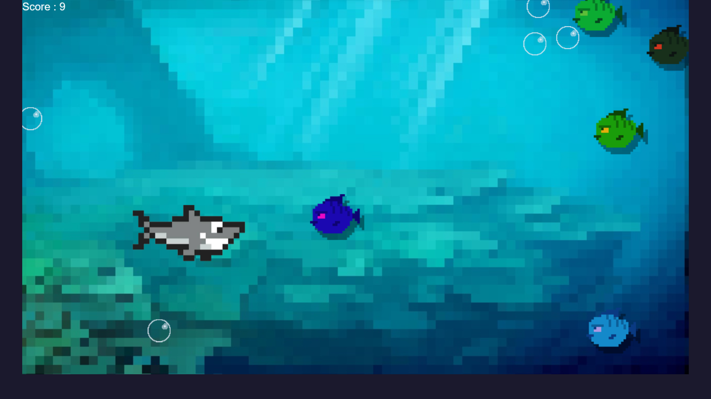

# Underwater Adventure Game

This project is a simple, interactive 2D game built with TypeScript and PIXI.js. The game is set in an underwater environment, where the player controls a shark to collide with as many fishes as possible.

## Game Components

1. **Shark**: The player controls the shark using the keyboard keys (W, A, S, D or Arrow keys). The goal is to collide with as many fishes as possible.

2. **Fish**: Fishes move randomly to the left. If a fish goes off the screen, it reappears on the right at a random y-coordinate.

3. **Bubble**: Bubbles move upwards. If a bubble goes off the screen, it reappears at the bottom at a random x-coordinate.

4. **Collision Detection**: The game checks for collisions between the shark and the fishes. If a collision is detected, the fish is repositioned, its color is changed, and the player's score is increased.

5. **Scoring**: The game keeps track of the player's score, which is the number of fishes the shark has collided with. The score is displayed on the screen.

## How to Run

To run the game, follow these steps:

1. Clone the repository to your local machine.
2. Install the dependencies using `npm install`.
3. Run the game using `npm start`.

Enjoy the underwater adventure!

# GitHub Pages
https://tj-abbing.github.io/PRG04-2021-2022-eindopracht/
## Prototype 1
https://github.com/TJ-Abbing/PRG04-2021-2022-prototype-1
## Prototype 2
https://github.com/TJ-Abbing/PRG04-2021-2022-prototype-2
## Prototype 3
https://github.com/TJ-Abbing/PRG04-2021-2022-prototype-3
## Final game
https://github.com/TJ-Abbing/PRG04-2021-2022-eindopracht
